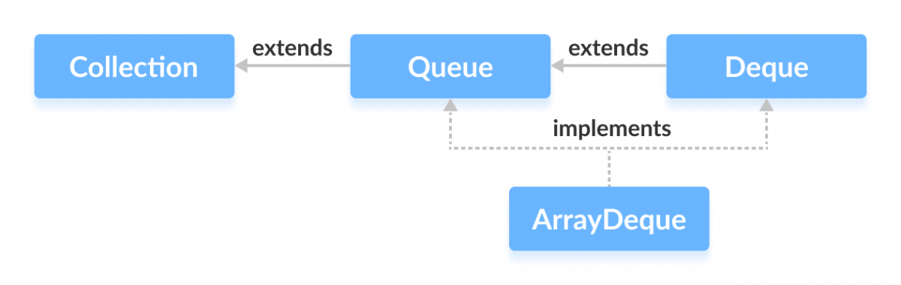

# ArrayDeque
Resizable-array implementation of the `Deque` interface. Null elements are prohibited. This class is likely to be faster than Stack when used as a stack, and faster than LinkedList when used as a queue.

## Constructor

|     Constructor |         Description                    |
|----------------------------|------------------------------------|
|     `ArrayDeque()`	       |   Constructs an empty array deque with an initial capacity sufficient to hold 16 elements.  |
|  `ArrayDeque(Collection<? extends E> c)` |     Constructs a deque containing the elements of the specified collection, in the order they are returned by the collection's iterator. |
|  `StringBuilder(int initCapacity)`	 |     Creates an empty string builder with the specified initial capacity. |
|  `ArrayDeque(int numElements)`	|  Constructs an empty array deque with an initial capacity sufficient to hold the specified number of elements. |

