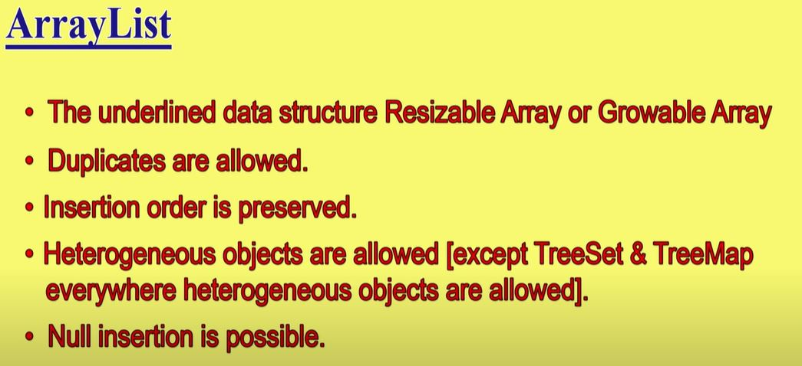
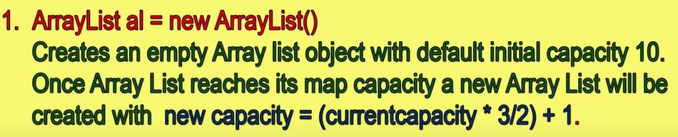

# ArrayList
ArrayList is a part of collection framework and is present in `java.util package`. It provides us with dynamic arrays in Java. Though, it may be slower than standard arrays but can be helpful in programs where lots of manipulation in the array is needed.
---

### NOTE: ArrayList is the <span style="color: green;">BEST</span> choice for retrieval operations while <span style="color: red;">WORST</span> choice for inserting values in some position of ArrayList


## Imp Properties of ArrayList.



## ArrayList Constructors



### To create ArrayList with capacity `initialCapacity`


### To convert a `Collection` object into an ArrayList, it creates an ArrayList from the objects of the `Collection` c


## Methods of ArrayList

* ### `boolean	add(Object o)`
  > Appends the specified element to the end of this ArrayList.

* ### `void add(int index, Object element)`
  > Inserts the specified element at the specified position in this ArrayList.

  ```java
     ArrayList<String> al = new ArrayList<>(); 
     al.add("Geeks"); 
     al.add("Geeks"); 
     al.add(1, "For");
     System.out.println(al); // [Geeks, For, Geeks]
  ```
  
        
* ### `boolean	addAll(Collection c)`
  > Appends all of the elements in the specified Collection to the end of this this ArrayList, in the order that they are returned by the specified Collection's Iterator.

* ### `boolean addAll(int index, Collection c)`
  > Inserts all of the elements in the specified Collection into this ArrayList, starting at the specified position.

* ### `void clear()`
  > Removes all of the elements from this ArrayList.

* ### `Object	clone()`
  > Returns a shallow copy of this ArrayList.

* ### `boolean	contains(Object elem)`
  > Returns true if this ArrayList contains the specified element.


* ### `int	indexOf(Object elem)`
  > Searches for the first occurence of the given argument, testing for equality using the equals method.

* ### `boolean	isEmpty()`
  > Tests if this ArrayList has no components.

* ### `int	lastIndexOf(Object elem)`
  > Returns the index of the last occurrence of the specified object in this ArrayList.

* ### `Object	remove(int index)`
  > Removes the element at the specified position in this ArrayList.
  ```java
     ArrayList<String> al = new ArrayList<>(); 
  
     al.add("Geeks"); 
     al.add("Geeks"); 
     al.add(1, "For"); 
  
     System.out.println("Initial ArrayList " + al); 
     //Initial ArrayList [Geeks, For, Geeks]
  
     al.remove(1); 
  
     System.out.println("After the Index Removal " + al); 
     //After the Index Removal [Geeks, Geeks]
     al.remove("Geeks"); 
  
      System.out.println("After the Object Removal " + al);
      //After the Object Removal [Geeks]
    ```
* ### `Object	set(int index, Object element)`
  > Replaces the element at the specified position in this ArrayList with the specified element.
  ```java
     ArrayList<String> al = new ArrayList<>(); 
  
     al.add("Geeks"); 
     al.add("Geeks"); 
     al.add(1, "Geeks"); 
     
     System.out.println("Initial ArrayList " + al); //Initial ArrayList [Geeks, Geeks, Geeks]
  
     al.set(1, "For"); 
  
     System.out.println("Updated ArrayList " + al); //Updated ArrayList [Geeks, For, Geeks]
   ```
* ### `Object	get(int index)`
  > Returns the element at the specified position in this ArrayList.

* ### `int size()`
  > Returns the number of components in this ArrayList.
  ```java
     ArrayList<String> al  = new ArrayList<>(); 
  
     al.add("Geeks"); 
     al.add("Geeks"); 
     al.add(1, "For"); 
  
        // Using the Get method and the 
        // for loop 
     for (int i = 0; i < al.size(); i++)

        System.out.print(al.get(i) + " "); 
  
     System.out.println(); 
  
     // Using the for each loop 
     for (String str : al) 
            System.out.print(str + " "); 
    } 
    ```