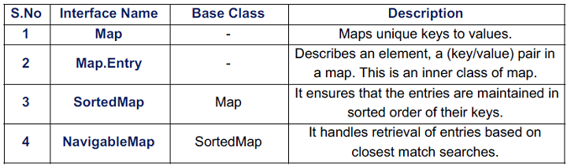
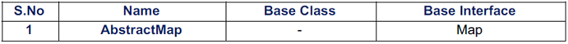
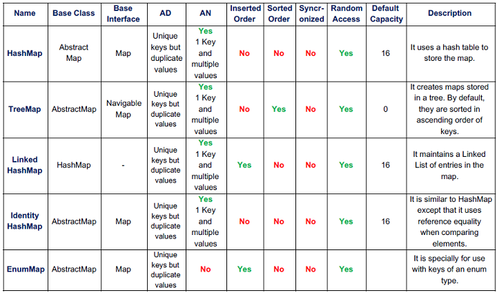
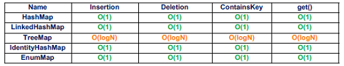
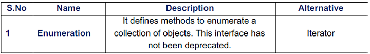
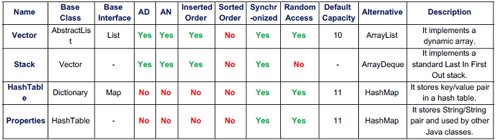

# Collections
### The Collection Framework Hierarchy

# ITERATOR
Iterators are used to cycle through or access all the elements of a collection in a particular order.

## STEPS TO USE AN ITERATOR:
---
1. Obtain an iterator to the start of the collection by calling collection’s `iterator()` method.
2. Set up a loop that makes a call to hasNext(). Have the loop iterate as long as `hasNext()`
returns `true`.
3. Within the loop, obtain each element by calling `next()`.

## TYPES OF ITERATOR:

---
# THE COLLECTION INTERFACES
The Collection Classes implementing these interfaces have the functionality of these
interfaces. Therefore, these interfaces define the core behavior of a Collection class.

## THE COLLECTION ABSTRACT CLASSES
The Abstract Classes provide skeletal implementations that are used as starting points for
creating concrete Collections.

## THE COLLECTION CLASSES

These standard classes provide full implementation of the Collection that can be used as-is.

The below table shows various differences between the Collection classes. The terms used
in the table are -

|           Abbreviation     |         Meaning                    |
|----------------------------|------------------------------------|
|     AD       |    Allow Duplicates: It tells whether that particular collection allows duplicate values to be inserted.     |
|       AN       |     Allow Null: It tells whether null objects can be inserted into that particular collection.    |
|     Inserted Order         |   It tells whether the objects are stored in the same order in which they were inserted.      |
|  Sorted Order      |   It tells whether the objects are stored in sorted order.      |
| Synchronized    |  It tells whether the collection is thread-safe or not.   |
|       Random Access       |  It tells whether the collection has a get() method to returns the index of an object or return the object using an index.       |
|       Default capacity     |       The initial capacity of the collection when it is created using an empty constructor.  |
|              |         |

The Time Complexities of basic operations are given below:

## MAPS

● A map is an object that stores key/value pairs.

● The keys must be unique but the values may be duplicated.

● Maps don’t implement the Iterable interface. Therefore, you can’t obtain an iterator to a
map.

## THE MAP INTERFACE

## THE MAP ABSTRACT CLASS:

## THE MAP CLASSES:

These classes provide concrete implementation of the Map which can used by programmers.

The Time Complexities of basic operations are given below:

## THE LEGACY CLASSES AND INTERFACES:

● These classes were used to store objects before the development of Collections
Framework.

● All the legacy classes are synchronized.

## THE LEGACY INTERFACE:

## THE LEGACY ABSTRACT CLASS:

## THE LEGACY CLASSES:

The below table shows the differences between various Legacy classes. The terms used in the table are same as the ones used in Collection classes table.

## Facts about Collections
1. TreeSet and TreeMap are sorted collections i.e they store the elements in an order.

2. compareTo(Obj obj1) method needs to be implemented if the class implements comparable interface whereas compare(Obj obj1, Obj obj2) needs to be implemented if it implements comparator inyterface.

3. After Java 1.5, TreeSet implements NavigableSet which in turn extends SortedSet. Earlier version used to have TreeSet implementing SortedSet.

4. A Class must override hashCode method if its overridding equal method. Not doing the same may create trouble in with hash collections and hash search.

5. A Class can override hashCode even if it's not overridding equals method.

6. If equals method is not overridden, Two objects are treated equal only if they are same i.e obj1 == obj2.

7. HashCode method should be implemeted such that it should generate same code for an object unless its state is changed. There shouldn't be use of random functions to generate the hashcode.

8. Collection is an interface whereas Collections is a utility class.

9. peek() method of PriorityQueue accesses the highest priority element but doesn't remove it , whereas poll() removes the highest priority element from the queue.

10. Set can have only one null value but not more than one as duplicates are not allowed.

11. `Collection<SuperClass>` cannot hold `Collection<BaseClass>`. 

      `Collection<SuperClass>` = new `ArrayList<SubClass>`; 

      results in compile time error.

12. Collections can be of objects only and not of primitives.

13. Arrays.sort only takes arrays as arguments whereas Collections.sort only takes list as argument. TreeSet is used for sorting Set and TreeMap is used for sorting Map.

14. LinkedHashMap maintains the entries in the order in which they were last accessed.

15. HashTable is thread safe whereas HashMap is not. That's why HashMap is faster than HashTable.

16. HashMap can have null keys as well as null values whereas HashTable cannot have either.

17. Sorted collections ( TreeMap , TreeSet ) cannot have heterogeneous objects. Reason being heterogenous object cannot be compared and hence elements cannot be sorted. It throws ArrayStoreException if we try to add non compatible object.

18. Map interface doesn't extend the Collection interface. List, Set and Queue extends Collection interface.

19. If an instance of a class needs to be added to a sorted collection, either the class implements comparable interface or Comparator should be specified during construction of sorted collection.
