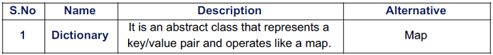

# Collections
### The Collection Framework Hierarchy

# ITERATOR
Iterators are used to cycle through or access all the elements of a collection in a particular order.

## STEPS TO USE AN ITERATOR:
---
1. Obtain an iterator to the start of the collection by calling collection’s `iterator()` method.
2. Set up a loop that makes a call to hasNext(). Have the loop iterate as long as `hasNext()`
returns `true`.
3. Within the loop, obtain each element by calling `next()`.

## TYPES OF ITERATOR:

---
# THE COLLECTION INTERFACES
The Collection Classes implementing these interfaces have the functionality of these
interfaces. Therefore, these interfaces define the core behavior of a Collection class.

## THE COLLECTION ABSTRACT CLASSES
The Abstract Classes provide skeletal implementations that are used as starting points for
creating concrete Collections.

## THE COLLECTION CLASSES

These standard classes provide full implementation of the Collection that can be used as-is.

The below table shows various differences between the Collection classes. The terms used
in the table are -

|           Abbreviation     |         Meaning                    |
|----------------------------|------------------------------------|
|     AD       |    Allow Duplicates: It tells whether that particular collection allows duplicate values to be inserted.     |
|       AN       |     Allow Null: It tells whether null objects can be inserted into that particular collection.    |
|     Inserted Order         |   It tells whether the objects are stored in the same order in which they were inserted.      |
|  Sorted Order      |   It tells whether the objects are stored in sorted order.      |
| Synchronized    |  It tells whether the collection is thread-safe or not.   |
|       Random Access       |  It tells whether the collection has a get() method to returns the index of an object or return the object using an index.       |
|       Default capacity     |       The initial capacity of the collection when it is created using an empty constructor.  |
|              |         |

The Time Complexities of basic operations are given below:

## MAPS

● A map is an object that stores key/value pairs.

● The keys must be unique but the values may be duplicated.

● Maps don’t implement the Iterable interface. Therefore, you can’t obtain an iterator to a
map.

## THE MAP INTERFACE

## THE MAP ABSTRACT CLASS:

## THE MAP CLASSES:

These classes provide concrete implementation of the Map which can used by programmers.

The Time Complexities of basic operations are given below:

## THE LEGACY CLASSES AND INTERFACES:

● These classes were used to store objects before the development of Collections
Framework.

● All the legacy classes are synchronized.

## THE LEGACY INTERFACE:

## THE LEGACY ABSTRACT CLASS:

## THE LEGACY CLASSES:

The below table shows the differences between various Legacy classes. The terms used in the table are same as the ones used in Collection classes table.

