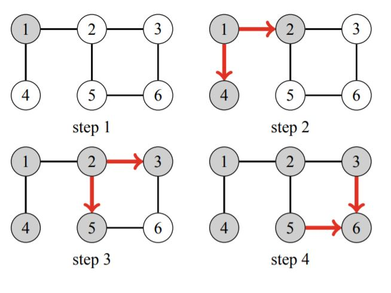

# Breadth-First Search
**Breadth-first search (BFS) visits the nodes of a graph in increasing order of their distance from the starting node.** Thus, we can calculate the distance from the starting
node to all other nodes using breadth-first search. Breadth-first search goes through the nodes one level after another. However breadth-first search is more difficult to implement than depth-first search. The queue q contains nodes to be processed in increasing order of their distance.

Like in depth-first search, the time complexity of breadth-first search is `O(n + m)`, where n is the number of nodes and m is the number of edges.