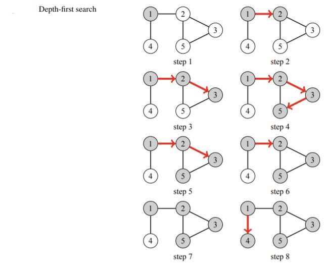

# Depth-First Search
Depth-first search (DFS) is a straightforward graph traversal technique. The algorithm begins at a starting node, and proceeds to all other nodes that are reachable from the starting node using the edges of the graph.
Depth-first search always follows a single path in the graph as long as it finds new nodes. After this, it returns to previous nodes and begins to explore other parts of the graph. The algorithm keeps track of visited nodes, so that it processes each node only once.

The **time complexity** of depth-first search is `O(n + m)` where n is the number of nodes and m is the number of edges, because the algorithm processes each node and edge once.

## Applications of Graph Traversal

* ### Connectivity Check 
    A graph is connected if there is a path between any two nodes
    of the graph. Thus, we can check if a graph is connected by starting at an arbitrary
    node and finding out if we can reach all other nodes.

* ### Cycle Detection
    A graph contains a cycle if during a graph traversal, we find a node whose neighbor (other than the previous node in the current path) has already
    been visited.
    > NOTE: Another way to determine if a graph contains a cycle is to simply calculate the number of nodes and edges in every component. If a component contains c nodes and no cycle, it must contain exactly c − 1 edges (so it has to be a tree). If there are c or more edges, the component surely contains a cycle.

* ### Bipartiteness Check
    A graph is bipartite if its nodes can be colored using two colors so that there are no adjacent nodes with the same color. The idea is to pick two colors `X` and `Y` , color the starting node `X`, all its neighbors `Y` , all their neighbors `X`, and so on. If at some point of the search we notice that two adjacent nodes have the same color, this means that the graph is not bipartite. Otherwise, the graph is bipartite and one coloring has been found.

* ### SSSP(Single Source Shortest Path)
    For a tree, graph traversal can find the shortest part from a node A to B.