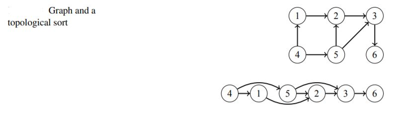

# Topological Sorting

An important class of graphs is directed acyclic graphs, also called **DAGs**. 

> A topological sort is an ordering of the nodes of a directed graph such that if there is a path from node a to node b, then node a appears before node b in the ordering. A directed graph has a topological sort exactly when it is acyclic.

If the graph contains a cycle, it is not possible to form a topological sort, because no node of the
cycle can appear before the other nodes of the cycle in the ordering. 
It turns out that DFS can be used to both check if a directed graph contains a cycle and, if it does not, to construct a topological sort.

Algorithm: 