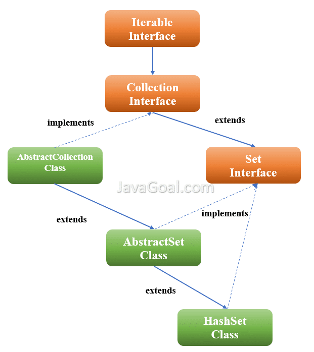

# HashSet
This class implements the Set interface, backed by a hash table (actually a HashMap instance). Permits the null element. **The class also offers constant time performance for the basic operations like add, remove, contains, and size functions.**

## Important Points about the HastSet
1. HashSet doesn’t maintain any order, the elements would be returned in any random order.
2. Duplicates are not allowed.
3. Allows a null value to be present.
4. HashSet is non-synchronized, can be synchronized explicitly.

## Constructor

|     Constructor |         Description                    |
|----------------------------|------------------------------------|
|  `HashSet<E> hs = new HashSet<E>();` | Constructs a new, empty set; the backing HashMap instance has default initial capacity (16) and load factor (0.75) |
|  `HashSet<E> hs = new HashSet<E>(Collection C);` |     Constructs a new set containing the elements in the specified collection. |
|  `HashSet<E> hs = new HashSet<E>(int initialCapacity);` |     Constructs a new, empty set; the backing HashMap instance has the specified initial capacity and default load factor (0.75). |

## Methods

