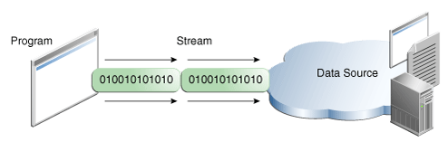

# Overview of Java I/O
## Key points to know
* Java uses the concept of the stream to make I/O operations fast. The java.io package contains all the classes required for input and output operations.
* **A stream is a sequence of data.** In Java, a stream is composed of bytes. It's called a stream because it is like a stream of water that continues to flow.

## Working of I/O Streams
A program that needs to read data from some source needs an `InputStream` or a `Reader`(abstract) class, one item at a time.

A program that needs to read data from some source needs an `OutputStream` or a `Writer`(abstract) class, one item at a time.

##  Java IO Classes Overview

