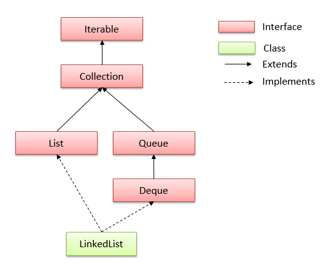

# LinkedList
Linked List is a part of the Collection framework present in `java.util package`. This class is an implementation of the LinkedList data structure which is a linear data structure where the elements are not stored in contiguous locations and every element is a separate object with a data part and address part.

## Imp Properties of ArrayList.

# LinikedList Constructors

### To create empty LinkedList Object

### To create equivalent LinkedList Object for the given Collection

* ### `boolean add(Object o)`
  > Appends the specified element to the end of a list.
* ### `void add(int index, Object element)`
  > Inserts the specified element at the specified position index in a list.
* ### `void addFirst(Object o)` :
  >Inserts the given element at the beginning of a list.
* ### `void addLast(Object o)` :
  > Appends the given element to the end of a list.
* ### `int size()` : 
  > Returns the number of elements in a list
* ### `boolean contains(Object o)` 
  > Return true if the list contains a specified element, else false.
* ### `boolean remove(Object o)` 
  > Removes the first occurence of the specified element in a list.
* ### `Object getFirst()` 
  >Returns the first element in a list.
* ### `Object getLast()`
  > Returns the last element in a list.
* ### `int indexOf(Object o)`
  > Returns the index in a list of the first occurrence of the specified element, or -1 if the list does not contain specified element.
* ### `lastIndexOf(Object o)`
  > Returns the index in a list of the last occurrence of the specified element, or -1 if the list does not contain specified element.
* ### `Iterator iterator()`
  > Returns an iterator over the elements in this list in proper sequence.
* ### `Object[] toArray()`
  > eturns an array containing all of the elements in this list in proper sequence.
* ### `List subList(int fromIndex, int toIndex)` : returns a view of the portion of this list between the specified fromIndex (inclusive) and toIndex (exclusive).