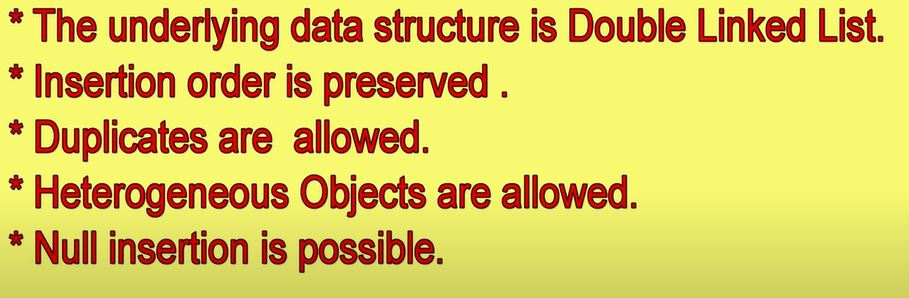
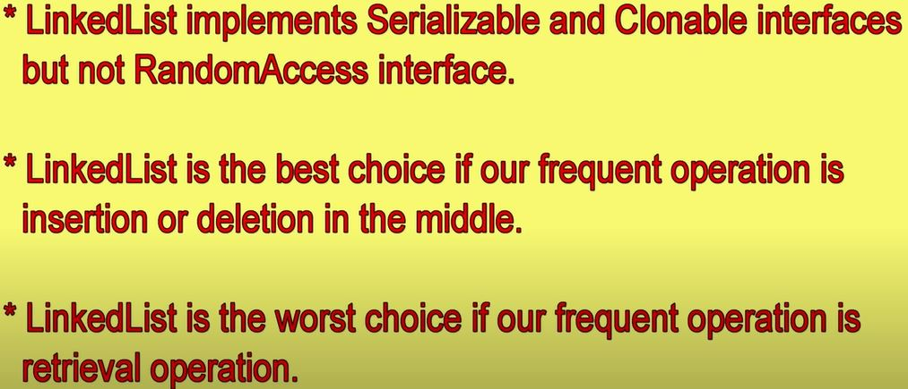

# LinkedList
Linked List is a part of the Collection framework present in `java.util package`. This class is an implementation of the LinkedList data structure which is a linear data structure where the elements are not stored in contiguous locations and every element is a separate object with a data part and address part.

## Imp Properties of ArrayList.

# LinikedList Constructors

To create empty LinkedList object

